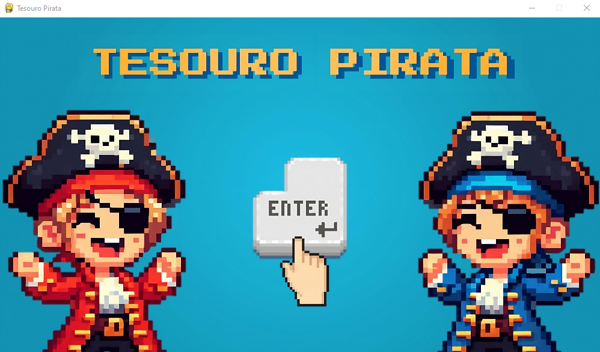
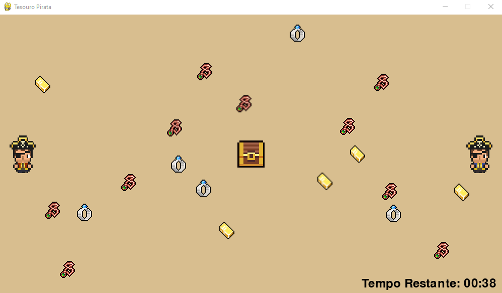
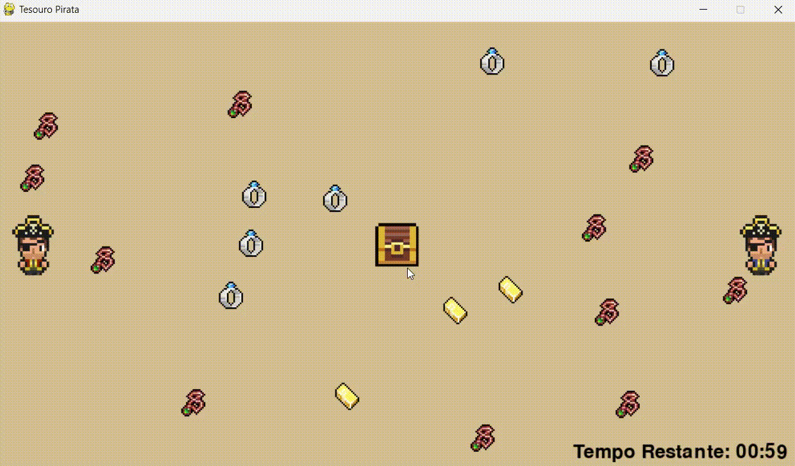
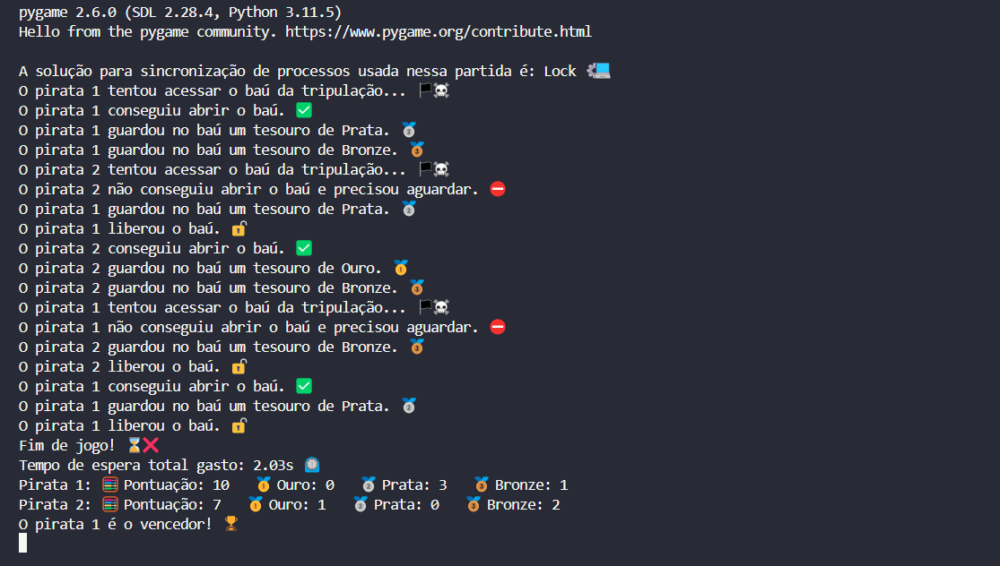

# 🏴‍☠️ Tesouro Pirata 🏴‍☠️
Tesouro Pirata é um jogo divertido onde os jogadores controlam piratas que coletam tesouros e os depositam em um baú da tripulação que é compartilhado. O objetivo é coletar o máximo de tesouros possível antes que o tempo acabe. O jogador com mais pontos vence!

## Funcionalidades
* Movimentação do Jogador: Controle ambos os piratas usando o mesmo teclado.
* Coleta de Tesouros: Pegue os tesouros espalhados pelo mapa.
* Depósito no Baú: Deposite os tesouros coletados no baú compartilhado.
* Sistema de Animação: Animações suaves para movimentos dos piratas.
* Multijogador Local: Jogue com um amigo no mesmo teclado.

## ⚙️ Mecânicas do Jogo
### Coleta de Tesouros
Cada jogador pode carregar até 3 tesouros na mochila. Para coletar um tesouro, basta se mover sobre ele. Os tesouros aparecem aleatoriamente pelo mapa e podem ser de três tipos:
- 🥉 Bronze: 1 ponto
- 🥈 Prata: 3 pontos
- 🥇 Ouro: 5 pontos

### Depósito no Baú
O baú compartilhado está no centro do mapa. Para depositar tesouros, mova-se até o baú e pressione a tecla de ação (F para Jogador 1, 0 para Jogador 2). Porém existe algumas coisas que o jogador precisa levar em conta:
- Se o baú estiver disponível, o jogador pode depositar os seus tesouros, caso ele tenha coletado algum, e ganhar os pontos. ✅
- Se o baú estiver em uso, o jogador precisa esperar até que ele esteja disponível. ⛔

### Região Crítica e Condição de Corrida
O baú compartilhado é uma região crítica onde apenas um pirata pode acessar por vez. Utilizei threading.Lock para evitar condições de corrida ao depositar tesouros. Se um pirata tentar acessar o baú enquanto ele está em uso, ele precisará esperar até que o baú seja liberado, você pode acompanhar o terminal com os logs para checar isso. Consulte `models/Pirate.py` para checar esta implementação:
```python
def _depositTreasure(self, SharedChest):
    print(f'O pirata {self.id} tentou acessar o báu da tripulação... 🏴‍☠️')
    if SharedChest.lock.acquire(timeout=1): # Tentar adquirir o lock com timeout de 1 segundo
        try:
            SharedChest.inUse = True
            print(f'O pirata {self.id} conseguiu abrir o baú. ✅')
            if len(self.backpack) > 0:
                for treasure in self.backpack:
                    time.sleep(stts.depositDuration/ 1000)
                    SharedChest.treasures.append((treasure, self.id))
                    print(f'O pirata {self.id} guardou no baú um tesouro de {treasure.identifyRarity()}')
                self.backpack.clear()
            else:
                SharedChest.inUseWithoutTreasure = True
                time.sleep((stts.depositDuration/3.5)/ 1000) # Segura um tempinho para animar a abertura do baú.
                print(f'O pirata {self.id} não tem nenhum tesouro, fechando baú... 🪙❓')
                return
        finally:
            SharedChest.lock.release()
            SharedChest.inUse, SharedChest.inUseWithoutTreasure = False, False
            self.cannotMove = False # Libera os movimentos.
            print(f"O pirata {self.id} liberou o báu. 🔓")
    else:
        SharedChest.inUse, SharedChest.inUseWithoutTreasure = False, False
        self.cannotMove = False # Libera os movimentos.
        print(f'O pirata {self.id} não conseguiu abrir o baú e precisou aguardar. ⛔')

def action(self, SharedChest, keyState):
    playerRect, chestRect = self.getRect(), SharedChest.getRect()
    if playerRect.colliderect(chestRect):
        if keyState[self.control.action] and not self.cannotMove:
            self.cannotMove = True
            threading.Thread(target=self._depositTreasure, args=(SharedChest,)).start()
```

## ⌨️ Controles
* Jogador 1:
    - Movimento: W, A, S, D
    - Ação: F
* Jogador 2:
    - Movimento: Setas do teclado
    - Ação: Tecla 0 (numérica)

## 📸 Screenshots
<p align="center">
  
  
  
  
</p>

## 🚀 Como Rodar
Siga estas etapas para configurar e executar o projeto localmente.

### Pré-requisitos
- Python 3.8+
- Pygame

## Instalação
1. Instale a biblioteca pygame, para mais informações consulte o [Pypi do Pygame](https://pypi.org/project/pygame/).
```sh
pip install pygame
```

2. Clone e navegue até diretório do repositório.
```sh
git clone https://github.com/DavidOSilva/TesouroPirata
cd TesouroPirata
```

3. Executando o Jogo. O jogo será iniciado e a janela do Pygame será aberta.
```sh
python main.py
```

## 🗂️ Estrutura do Projeto
* `main.py`: Arquivo principal para iniciar o jogo.
* `models/`: Contém as classes principais do jogo, como Pirate, SharedChest e Treasure.
* `interfaces/`: Contém as interfaces usadas no projeto.
* `consts/`: Contém constantes e configurações do jogo.
* `assets/`: Contém imagens e outros recursos do jogo.

## 📜 Licença
Distribuído sob a licença MIT. Veja LICENSE para mais informações.

## 📬 Contato
David Oliveira Silva - @DavidOSilva - davidoliveirasilvaa@gmail.com

Link do Projeto: https://github.com/DavidOSilva/TesouroPirata