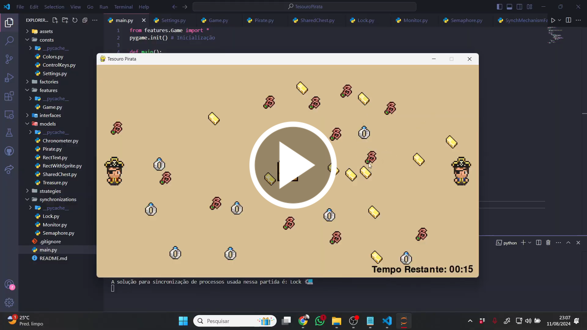
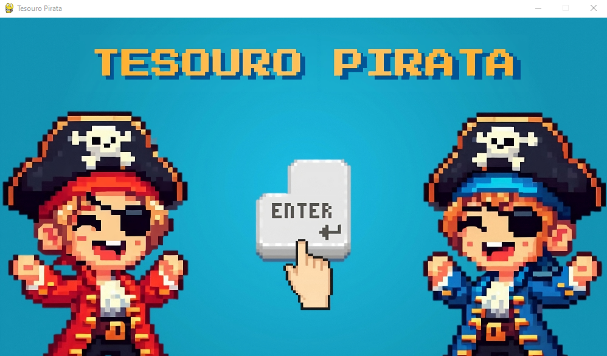
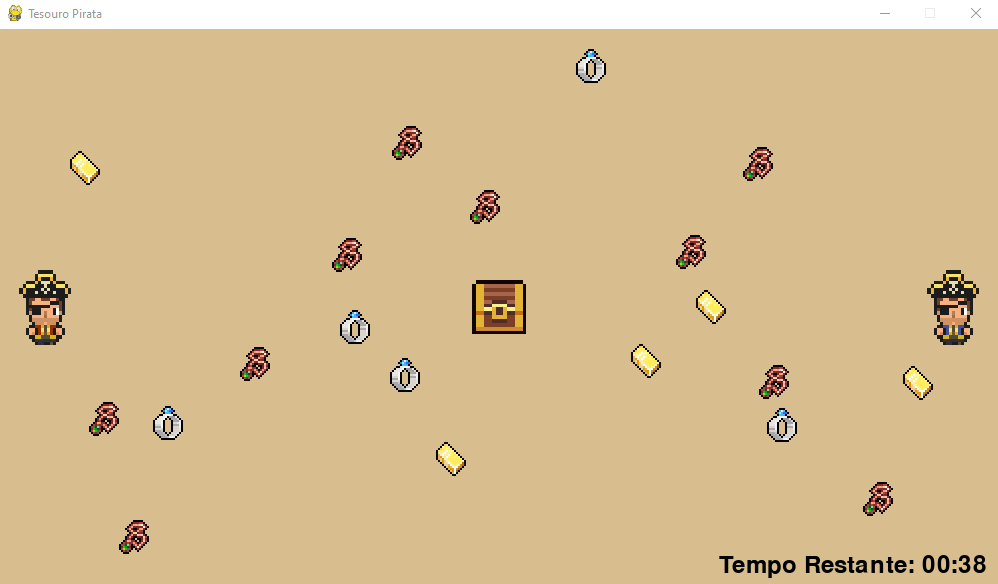
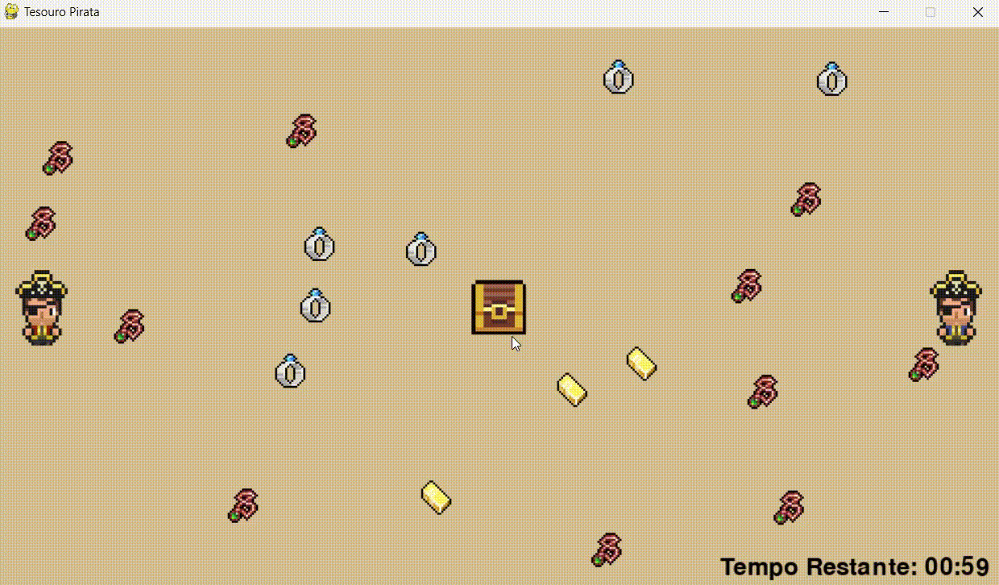
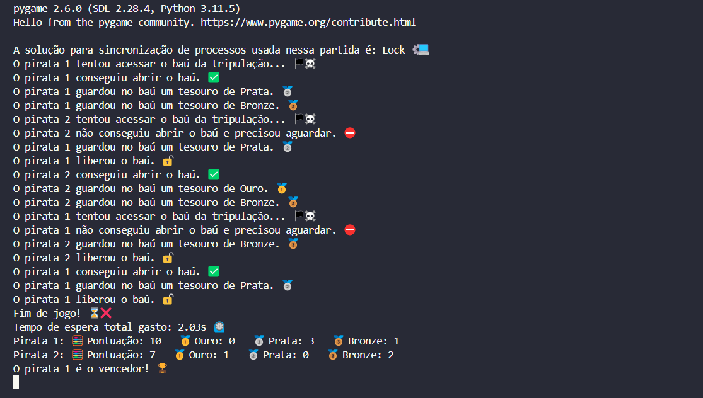

# 🏴‍☠️ Tesouro Pirata 🏴‍☠️
Tesouro Pirata é um jogo divertido onde os jogadores controlam piratas que coletam tesouros e os depositam em um baú da tripulação que é compartilhado. O objetivo é coletar o máximo de tesouros possível antes que o tempo acabe. O jogador com mais pontos vence!

## 📽️ Apresentação do Projeto
Confira a apresentação do projeto em vídeo abaixo:
[](https://drive.google.com/file/d/1vxdSUzatG8Mjl8uo0tbZkErt74H7_JPd/)

Este vídeo fornece uma visão geral detalhada das funcionalidades e objetivos do projeto. É uma ótima maneira de entender o que estamos tentando alcançar e como você pode se envolver. Se você tiver algum problema para assistir ao vídeo ou precisar de mais informações, não hesite em entrar em contato!

## 🕹️ Funcionalidades
* Movimentação do Jogador: Controle ambos os piratas usando o mesmo teclado.
* Coleta de Tesouros: Pegue os tesouros espalhados pelo mapa.
* Depósito no Baú: Deposite os tesouros coletados no baú compartilhado.
* Sistema de Animação: Animações suaves para movimentos dos piratas.
* Surgimento Tesouros: Novos tesouros vão surgindo ao longo da partida em posições aleatórias.

## ⚙️ Mecânicas do Jogo
### 💎 Coleta de Tesouros
Cada jogador pode carregar até 3 tesouros na mochila. Para coletar um tesouro, basta se mover sobre ele. Os tesouros aparecem aleatoriamente pelo mapa e podem ser de três tipos:
- 🥉 Bronze: 1 ponto
- 🥈 Prata: 3 pontos
- 🥇 Ouro: 5 pontos

### 💼 Depósito no Baú
O baú compartilhado está no centro do mapa. Para depositar tesouros, mova-se até o baú e pressione a tecla de ação (F para Jogador 1, 0 para Jogador 2). Porém existe algumas coisas que o jogador precisa levar em conta:
- Se o baú estiver disponível, o jogador pode depositar os seus tesouros, caso ele tenha coletado algum, e ganhar os pontos. ✅
- Se o baú estiver em uso, o jogador precisa esperar até que ele esteja disponível. ⛔

### 🏁 Região Crítica e Condição de Corrida
O baú de tesouros da tripulação é uma região crítica onde apenas um pirata pode acessar por vez. Para evitar condições de corrida, utilizei o padrão Strategy para implementar diferentes mecanismos de sincronização de processos. Os mecanismos de sincronização atualmente disponíveis são: Semaphore, Lock e Monitor. Dependendo da configuração, o comportamento da sincronização varia:

- **Semaphore**: 
  - Foi utilizado `threading.Condition` para implementar um semáforo que controla o acesso ao baú. Se um pirata tentar acessar o baú enquanto ele está em uso, ele precisa esperar até que o semáforo seja liberado. Seus movimentos ficam bloqueados até que sua vez chegue.
- **Lock**:
  - Neste caso foi utilizado o `threading.Lock` para garantir que apenas um pirata possa acessar o baú por vez. Se o pirata não conseguir adquirir o lock, ele imprime uma mensagem informando que o baú está ocupado e ele espera sua vez para depositar os tesouros. Seus movimentos também são travados.
- **Monitor**:
  - Utiliza um mecanismo de monitor manualmente implementado para gerenciar o acesso ao baú. Utilizei `threading.Condition` para gerenciar a coordenação entre threads. Se o baú estiver em uso, o pirata também precisa aguardar parado até que ele seja liberado. 

Você pode alterar o comportamento de sincronização através do arquivo `consts/settings.py`, que seleciona a estratégia apropriada com base nas configurações fornecidas. Durante o tempo que um dos piratas espera para acessar o baú, um cronômetro interno é iniciado, a ideia é comparar o desempenho de cada solução da condição de corrida. Um modo de teste foi desenvolvido para medir o desempenho das soluções de condição de corrida adotadas. Neste modo, o botão de ação de ambos os jogadores passa a ser o mesmo, o que elimina a possibilidade de erro humano ao pressionar os botões de ação de ambos os piratas em diferentes intervalos de tempo, o que comprometeria o tempo acumulado. Além disso, neste modo as posições em que os tesouros são gerados são sempre as mesmas em cada nova partida. Ainda nesse sentido, observei que, para essa implementação, o uso de Lock oferece um tempo mais baixo e, portanto, um melhor desempenho. Abaixo você pode visualizar a implementação dos mecanismos de sincronização utilizados nesse projeto até o momento. As classes estão disponíveis em `strategies/synchronizations/`.

```python
class Semaphore():
    def __init__(self, value = 1):
        self.value = value # Determina o número máximo de threads que podem acessar a seção crítica simultaneamente.
        self.condition = threading.Condition()
    
    def down(self):
        with self.condition: # Método para uma thread esperar para entrar na seção crítica.
            while self.value <= 0: self.condition.wait() # Se o valor for 0 ou menor, a thread espera.
            self.value -= 1 # Decrementa o valor e permite que a thread prossiga.
    
    def up(self):
        with self.condition:  # Método para uma thread sinalizar que está saindo da seção crítica
            self.value += 1  # Incrementa o valor e notifica uma das threads que estão esperando
            self.condition.notify()

class Lock():
    def __init__(self):
        self.lock = threading.Lock()

    def acquire(self, timeout=0.5):
        return self.lock.acquire(timeout=timeout) # O timeout é o tempo máximo em segundos para tentar adquirir o lock.

    def release(self):
        self.lock.release() # Libera o lock adquirido.

class Monitor:
    def __init__(self):
        self.condition = threading.Condition(self.lock)
        self.inUse = False  # Indica se o recurso está em uso

    def enter(self):
        with self.condition:
            while self.inUse: 
                self.condition.wait() # Espera até que o recurso não esteja mais em uso
            self.inUse = True  # Marca o recurso como em uso

    def leave(self):
        with self.condition:
            self.inUse = False  # Libera o recurso
            self.condition.notify()  # Notifica todas as threads esperando na condição
```
Cada Thread chama a mesma função dentro da classe Pirate, mas a função em si pode variar de acordo com a solução escolhida durante a execução do código. A ideia por trás dessa abordagem é facilitar a manutenção e a extensão do código a medida que novas implementações de solução para a condição de corrida são adicionadas. Consulte `models/Pirate.py` para mais detalhes.
```python

    class Pirate(ISpritesAnimatorGenerator):
    
    def __init__(self, id, position, pngSprites, jsonSheet=Path("assets/pirate/pirateSpritesSheet.json"), size=stts.playerSize, state='idle', frame=0):
    # Outras inicializações...
    self.depositStrategy = SynchMechanismFactory().createDeposityStrategy()

    # Restante do código...

    def _depositTreasure(self, SharedChest): self.depositStrategy.deposit(self, SharedChest)

    def action(self, SharedChest, keyState):
        playerRect, chestRect = self.getRect(), SharedChest.getRect()
        if playerRect.colliderect(chestRect):
            if keyState[self.control.action] and not self.cannotMove:
                self.cannotMove = True
                threading.Thread(target=self._depositTreasure, args=(SharedChest, )).start()
```
A fábrica é a classe que vai definir qual função será chamada para depositar os tesouros e qual o mecanismo de sincronização foi adotado, permitindo adquirir ou liberar a região crítica. Veja o código completo em `factories/SynchMechanismFactory.py`.
```python
class SynchMechanismFactory:

    def __init__(self, mechanism=stts.synchMenchanism.lower()): self.mechanism = mechanism

    def createSynchMechanism(self):
        if self.mechanism == "semaphore":  return Semaphore()
        elif self.mechanism == "lock": return Lock()
        elif self.mechanism == "monitor": return Monitor()
        else: raise ValueError(f"Mecanismo de sincronização de processos inválido: {self.mechanism}")

    def createDeposityStrategy(self) ->  IDepositStrategy:
        if self.mechanism == "semaphore":  return SemaphoreDeposit()
        elif self.mechanism == "lock": return LockDeposit()
        elif self.mechanism == "monitor": return MonitorDeposit()
        else: raise ValueError(f"Mecanismo de sincronização de processos inválido: {self.mechanism}")
```

## ⌨️ Controles
* Jogador 1:
    - Movimento: W, A, S, D
    - Ação: F
* Jogador 2:
    - Movimento: Setas do teclado
    - Ação: Tecla 0 (numérica)

## 📸 Screenshots
<p align="center">
  
  
  
  
</p>

## 🚀 Como rodar Tesouro Pirata na sua máquina.
Siga estas etapas para configurar e executar o projeto localmente.

### Pré-requisitos
- Python 3.8+
- Pygame

## Instalação
1. Instale a biblioteca pygame, para mais informações consulte o [Pypi do Pygame](https://pypi.org/project/pygame/).
```sh
pip install pygame
```

2. Clone e navegue até diretório do repositório.
```sh
git clone https://github.com/DavidOSilva/TesouroPirata
cd TesouroPirata
```

3. Executando o Jogo. O jogo será iniciado e a janela do Pygame será aberta.
```sh
python main.py
```

## 🎛️ Alterar configurações do Jogo.
Como já foi mencionado, você pode acessar o arquivo `consts/settings.py` e fazer algumas alterações, como: tempo da partida, número de tesouros gerados, tempo de geração dos tesouros, velocidade do jogador, capacidade da mochila, tamanho da tela etc.
```python
class Settings:
    def __init__(self):
        self.width = 1000
        self.height = int(self.width*0.5575)
        self.margin = 20
        self.gameDuration = 60 * 1000
        self.synchMenchanism = "lock"
        self.isTest = False
        self.seed = 58

        self.playerSpeed = 7
        self.playerSize = [52, 75]
        self.playerBackpackCapacity = 3
        self.playerAnimationFrameRate = 10

        self.treasureSize = [30, 34]
        self.treasureValues = [1, 3, 5]
        self.treasureProbas = [0.5, 0.35, 0.15]
        self.treasureNumMax = 15
        self.treasureSpawnInterval = 5 * 1000 
        self.treasureSpawnAmount = 2

        self.sharedChestSize = [54, 54]
        self.sharedChestPosition = self.width // 2 - self.sharedChestSize[0] // 2, self.height // 2 - self.sharedChestSize[1] // 2
        self.depositDuration = 1.2 * 1000
```

## 🗂️ Estrutura do Projeto
* `main.py`: Arquivo principal para iniciar o jogo.
* `models/`: Contém as classes principais do jogo, como Pirate, SharedChest e Treasure.
* `interfaces/`: Contém as interfaces usadas no projeto.
* `consts/`: Contém constantes e configurações do jogo.
* `assets/`: Contém imagens e outros recursos do jogo.
* `factories/`: Contém as fábricas que criam instâncias de estratégias e mecanismos de sincronização.
* `strategies/`:  Contém as funções que serão chamadas pelas thread dependendo de qual abordagem foi escolhida.
* `synchronizations/`: Contém as implementações das soluções de condição de corrida.

## 📜 Licença
Distribuído sob a licença MIT. Veja LICENSE para mais informações.

## 📬 Contato
David Oliveira Silva - @DavidOSilva - davidoliveirasilvaa@gmail.com
Link do Projeto: https://github.com/DavidOSilva/TesouroPirata